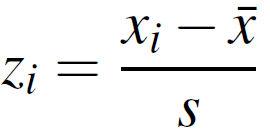

# IA04: SQLite and Standardizing Variables/Measures

DUE: Must be pushed to your individual repo by 5 PM, September 24

<sub>If you're late (see penalties outline in syllabus) you must notify myself and the TA by email ASAP so that we don't mark any partially completed assignment that may exist in your repo.</sub>

## Standardizing Measures


In data analysis (business analytics, data science, etc.) we often look to compare multiple dimensions, or features, of a given dataset. Often these features are measured using different scales. For instance, if we where recording information on a car we might have a measure of fuel economy in mpg and price in dollars. Any analysis that compares these two different scales (to derive cross dimensional insights such as "bigger" or "smaller", etc.) is rather meaningless due to the rather arbitrary nature (and difference) of each scale. Furthermore, unlike differing scales such as kilometers and miles that have an underlying common measure (distance), dollars and fuel economy do not.

One way around this problem is to derive a relative measure for each variable; that is, not fuel economy as measured using an mpg scale, but rather a standardized measure of how different the mpg is for one car versus all other cars in the set. Similarly, for price, we could translate our price measure into a standardized measure of difference against the entire set of cars being analyzed. This process is called "standardizing" a variable, and it produces what we refer to as a "scaleless" measure that allows us to compare these measures and assist in doing things like cluster analysis, or calculating a measure of similarity. We'll talk about this topic in greater depth later in this course, but for now, I've developed this exercises for you to brush up on your basic statistics and continue to advance your data handling python skills.

## Background
A standardized variable (sometimes called a z-score or a standard score) is a variable that has been rescaled to have a mean of zero and a standard deviation of one.

<sub>(note: the formula 'picture', and the 1st and 3rd paragraph of the following three are taken from http://www.statisticshowto.com/how-to-calculate-a-z-score/)</sub>

A z-score is a measure of how many standard deviations below or above the population mean a raw score is. A z-score is also known as a standard score and it can be placed on a normal distribution curve. Z-scores range from -3 std devs (which would fall to the far left of the normal distribution curve) to +3 std devs (which would fall to the far right of the normal distribution curve). In order to use a z-score, you need to know the mean μ and the population standard deviation σ. Simply put, a z-score is the number of standard deviations from the mean a data point is.

Typically, in datascience we will not make assumptions about the population but rather utilize the data we have at hand (and techniques such as bootstrapping), therefore, it is common practice to calculate the standardized value as follows:



This is exactly the same formula as z = x – μ / σ, except that x̄ (the sample mean) is used instead of μ (the population mean) and s (the sample standard deviation) is used instead of σ (the population standard deviation).

## Task:

This is an exercise to test your ability to create, manipulate, and query a SQLite database, and use standard Python datatypes and operations to conduct analysis. __You are limited to importing only sqlite3, csv, statistics and no other packages.__

>__NOTE__:  You can find information on the statistics module here  https://docs.python.org/3/library/statistics.html

Given the universities.csv file (found in the IA04 directory), the task for this exercise is to create a called udata.py that does the following:

1. Creates a database in SQLite called ia04.sqlite.
2. Within the ia04.sqlite database, loads universities.csv into a new table called universities.
 * Column names for the universities table should match the header names found within the csv files.
 * Field/Column types in database should best match the data found within the csv - this will require your judgement based on your observations of the data values, and the available SQLite standard types.
3. Calculates the mean, and standard deviation of each numeric column.
4. Creates a standardized value column for each numeric column.

__NOTE__: To help illustrate step 4, let's say for example we have two numeric columns: col1 and col2. Given two numeric columns col1, and col2 we would standardize each value of col1 and col2 and store this value in an associated new column:

```
col1, col1_std, col2, col2_std
234, 1.1, 1189, 0.9
245, 1.2, 500, 0.4
etc.
```

#### Note:

Knowledge of the following might come in handy for this exercise...

```
>>> a = '1,000,000'
>>> int(a.replace(',', ''))
1000000
```
